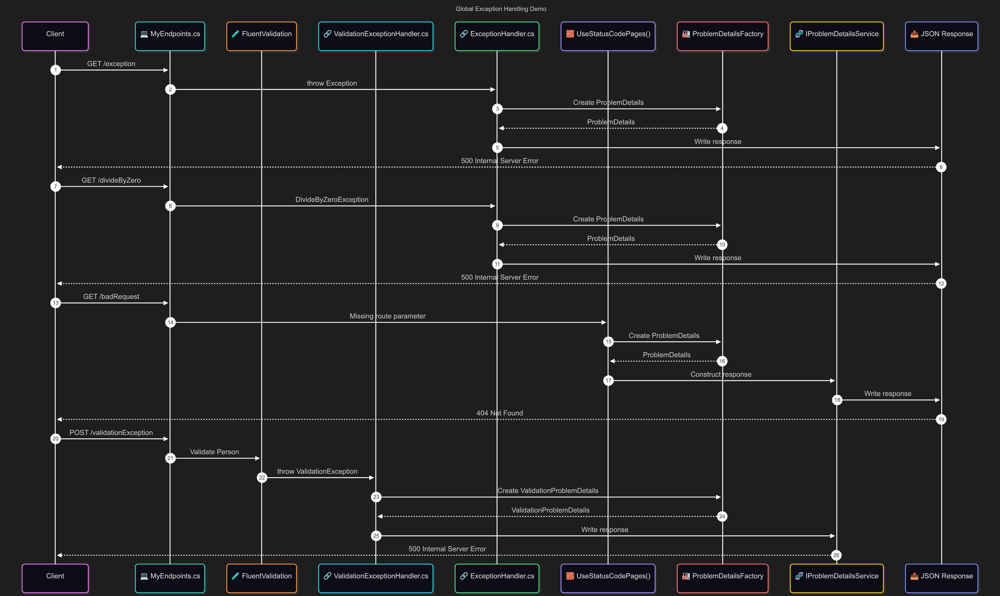

<!--
# 📚 Table of Contents

- [📘 Global Exception Handling Demo](#-global-exception-handling-demo)
	- [🎯 Key Objectives](#-key-objectives)
	- [🗂️ Project Structure](#-project-structure)
	- [🧱 Startup Configuration](#-startup-configuration)
		- [🧱 `Program.cs`](#-program.cs)
		- [🧱 `Startup/IoC.cs`](#-startupioc.cs)
		- [🧱 `Startup/Middleware.cs`](#-startupmiddleware.cs)
    - [💻 Endpoints](#-endpoints)
		- [💻 Endpoint Definitions (`Endpoints/MyEndpoints.cs`)](#-endpoint-definitions-endpointsmyendpoints.cs)
		- [📦 Person DTO (`Dto/Person.cs`)](#-person-dto-dtoperson.cs)
		- [🔍 Person Validations (`Validations/PersonValidator.cs`)](#-person-validations-validationspersonvalidator.cs)
		- [🖥️ Sample HTTP Requests (`GlobalExceptionHandler.http`)](#-sample-http-requests-globalexceptionhandler.http)
    - [🧾 Sample Error Responses](#-sample-error-responses)
		- [🧾 Unhandled Exception (`/exception`)](#-unhandled-exception-exception)
		- [🧾 Unhandled Exception (`/divideByZero`)](#-unhandled-exception-dividebyzero)
		- [🧾 Auto-Generated 404 (`/badRequest`)](#-auto-generated-404-badrequest)
		- [🧾 Validation Failure (`/validationException`)](#-validation-failure-validationexception)
    - [🔧 Defining Middleware in ASP.NET Core](#-defining-middleware-in-asp.net-core)
		- [🔍 Comparison of Middleware Strategies](#-comparison-of-middleware-strategies)
		- [🔧 Inline Middleware](#-inline-middleware)
		- [🔧 Conventional Class-Based Implementation](#-conventional-class-based-implementation)
		- [🔧 Factory-Based Middleware (`IMiddleware`)](#-factory-based-middleware-imiddleware)
    - [🧪 Problem Details Integration](#-problem-details-integration)
		- [📘 RFC Reference](#-rfc-reference)
		- [⚒️ Enabling ProblemDetails for Minimal APIs](#-enabling-problemdetails-for-minimal-apis)
		- [🧱 Creating and Delivering ProblemDetails Responses](#-creating-and-delivering-problemdetails-responses)
        	- [⚙️ Manually Constructing ProblemDetails (Not Recommended)](#-manually-constructing-problemdetails-not-recommended)
				- [⚙️ Create a ProblemDetails instance manually](#-create-a-problemdetails-instance-manually)
				- [⚙️ Create a ValidationProblemDetails instance manually](#-create-a-validationproblemdetails-instance-manually)
            - [🏭 Constructing ProblemDetails using `ProblemDetailsFactory`](#-constructing-problemdetails-using-problemdetailsfactory)
				- [🏭 Create a ProblemDetails instance](#-create-a-problemdetails-instance)
				- [🏭 Create a ValidationProblemDetails instance](#-create-a-validationproblemdetails-instance)
        	- [🧬 Delivering Structured Responses via `IProblemDetailsService`](#-delivering-structured-responses-via-iproblemdetailsservice)
    - [🧰 Configuring Global Exception Handlers](#-configuring-global-exception-handlers)
		- [🧰 Try/Catch within Middleware](#-trycatch-within-middleware)
		- [🧰 `IExceptionHandler` Interface (.NET 8+)](#-iexceptionhandler-interface-.net-8)
			- [🧩 Why Use `IExceptionHandler`?](#-why-use-iexceptionhandler)
			- [🧬 Integration with ASP.NET Core](#-integration-with-asp.net-core)
			- [📘 Best Practices](#-best-practices)
		- [🧰 Chained Exception Handlers](#-chained-exception-handlers)
			- [🧬 Registration Order Matters](#-registration-order-matters)
			- [🧠 Demonstration](#-demonstration)
				- [🔗 `ExceptionHandlers/ValidationExceptionHandler.cs`](#-exceptionhandlersvalidationexceptionhandler.cs)
				- [🔗 `ExceptionHandlers/ExceptionHandler.cs`](#-exceptionhandlersexceptionhandler.cs)
	- [🔄 End-to-End Request Pipeline: From Request to Structured Error Response](#-end-to-end-request-pipeline-from-request-to-structured-error-response)
	- [🧭 Endpoint Execution Flow — Visualized](#-endpoint-execution-flow-visualized)
	- [🚨 Common Pitfalls](#-common-pitfalls)
        - [1. Assuming `Results.BadRequest(...)` Always Returns `ProblemDetails`](#1.-assuming-results.badrequest...-always-returns-problemdetails)
    	- [2. Mixing `TypedResults.Ok(...)` and `TypedResults.BadRequest(...)` in Ternary Expressions](#2.-mixing-typedresults.ok...-and-typedresults.badrequest...-in-ternary-expressions)
		- [3. Forgetting to Enable `UseStatusCodePages()`](#3.-forgetting-to-enable-usestatuscodepages)
		- [4. Returning Plain Strings Instead of Structured Errors](#4.-returning-plain-strings-instead-of-structured-errors)
		- [5. Not Registering `AddControllers()` When Using `ProblemDetailsFactory`](#5.-not-registering-addcontrollers-when-using-problemdetailsfactory)
	- [✅ Best Practices](#-best-practices)
	- [🧭 Scenarios Where This Shines](#-scenarios-where-this-shines)
	- [📚 References](#-references)
-->

# 📘 Global Exception Handling Demo

[](https://www.nuget.org/packages/Microsoft.AspNetCore.OpenApi/)
[](https://www.nuget.org/packages/FluentValidation.AspNetCore/)

Modern APIs must not only deliver results, they must fail gracefully.

Built on **.NET 9**, this demo showcases how to implement structured and consistent error handling in ASP.NET Core using the built-in [`ProblemDetails`](https://learn.microsoft.com/en-us/dotnet/api/microsoft.aspnetcore.mvc.problemdetails) or [`ValidationProblemDetails`](https://learn.microsoft.com/en-us/dotnet/api/microsoft.aspnetcore.mvc.validationproblemdetails) types.

By combining Minimal APIs with centralized exception handlers and validation-aware responses, this project demonstrates how thoughtful design enhances both developer experience and consumer clarity. Whether you're building internal services or public APIs, these practices ensure failures are meaningful, traceable, and cleanly formatted.

## 🎯 Key Objectives

This demo is designed to help:

- ✅ Understand the purpose and structure of `ProblemDetails` and `ValidationProblemDetails` responses in ASP.NET Core.
- 🧩 Implement global exception handling using the `IExceptionHandler` interface introduced in .NET 8.
- 🔧 Configure middleware components `UseExceptionHandler`, `UseStatusCodePages` to enable consistent error serialization.
- 🧱 Use `ProblemDetailsFactory` to generate compliant error objects, and `IProblemDetailsService` to write structured responses.
- ✨ Combine FluentValidation with Minimal APIs to return field-level validation feedback using `ValidationProblemDetails`.
- 📊 Visualize the request pipeline flow and error response handling using Mermaid charts.
- 🔍 Identify common pitfalls and best practices for maintaining clarity, usability, and spec compliance in production-grade APIs.

This walkthrough serves as a reliable reference for designing error responses that are structured, traceable, and expressive, helping clarify faults without sacrificing simplicity.

## 🗂️ Project Structure

This solution is organized for clarity and maintainability. Each folder encapsulates a distinct responsibility from startup configuration and endpoint mapping to validation and exception handling, making the codebase easy to navigate and extend.

```
├── GlobalExceptionHandler
│   ├── Dto
│   │   └── Person.cs				# Person request Dto
│   ├── Endpoints
│   │   └── MyEndpoints.cs			# Defines Minimal endpoints and demonstrates exception/validation scenarios
│   ├── ExceptionHandlers
│   │   ├── ExceptionHandler.cs			# Handles all generic (unhandled) exceptions as a global fallback, returning structured responses.
│   │   └── ValidationExceptionHandler.cs	# Handles validation exceptions and formats validation errors
│   ├── Startup
│   │   ├── IoC.cs				# Configures dependency injection, JSON, and ProblemDetails options
│   │   └── Middleware.cs			# Sets up the middleware pipeline (exception handling, status code pages, OpenAPI)
│   ├── Validations
│   │   └── PersonValidator.cs			# FluentValidation rules for the Person Request Dto
│   └── Program.cs				# Main entry point. Builds and runs the web application
```

> 📎 Note:  Each module is designed to be self-contained yet cohesive, allowing the exception-handling strategy to scale without entangling unrelated concerns.

## 🧱 Startup Configuration

These files form the backbone of the demo, managing service registration and request pipeline configuration.

### 🧱 `Program.cs`

```csharp
var builder = WebApplication.CreateBuilder (args);

// Add services to the container.
builder.ConfigureIoCContainer ();

var app = builder.Build ();

// Configure the HTTP request pipeline.
app.ConfigurePipeline ();

app.UseHttpsRedirection ();

new MyEndpoints ().MapMyEndpoints (app);

app.Run ();
```

### 🧱 `Startup/IoC.cs`

```csharp
public static class IoC
{
	public static void ConfigureIoCContainer (this WebApplicationBuilder builder)
	{
		// Register Validation Exception Handler
		builder.Services.AddExceptionHandler<ValidationExceptionHandler> ();

		// Register Global Fallback Exception Handler
		builder.Services.AddExceptionHandler<ExceptionHandler> ();

		// Register Fluent Validators
		builder.Services.AddValidatorsFromAssemblyContaining<Program> ();

		// Learn more about configuring OpenAPI at https://aka.ms/aspnet/openapi
		builder.Services.AddOpenApi ();

		// Configure JsonOptions
		builder.Services.Configure<JsonOptions> (options =>
		{
			// Configure JSON serializer to ignore null values during serialization
			options.JsonSerializerOptions.DefaultIgnoreCondition = JsonIgnoreCondition.WhenWritingNull;

			// Configure JSON serializer to use Pascal case for property names during serialization
			options.JsonSerializerOptions.PropertyNamingPolicy = null;

			// Configure JSON serializer to use Pascal case for key's name during serialization
			options.JsonSerializerOptions.DictionaryKeyPolicy = null;

			// Ensure JSON property names are not case-sensitive during deserialization
			options.JsonSerializerOptions.PropertyNameCaseInsensitive = true;

			// Prevent serialization issues caused by cyclic relationships in EF Core entities
			options.JsonSerializerOptions.ReferenceHandler = ReferenceHandler.IgnoreCycles;

			// Ensure the JSON output is consistently formatted for readability.
			// Not to be used in Production as the response message size could be large
			// options.JsonSerializerOptions.WriteIndented = true;
		});

		// Register controllers to access ProblemDetailsFactory
		builder.Services.AddControllers ();

		// Configure ProblemDetails
		builder.Services.AddProblemDetails (options =>
		{
			options.CustomizeProblemDetails = context =>
			{
				context.ProblemDetails.Instance = $"{context.HttpContext.Request.Method} {context.HttpContext.Request.Path}";

				context.ProblemDetails.Extensions["requestId"] = context.HttpContext.TraceIdentifier;
			};
		});
	}
}
```

### 🧱 `Startup/Middleware.cs`
```csharp
public static class Middleware
{
	public static void ConfigurePipeline (this WebApplication app)
	{
		// Activates the global exception-handling middleware.
		// Routes unhandled exceptions to registered IExceptionHandler implementations.
		app.UseExceptionHandler ();

		// Returns a ProblemDetails response for (empty) non-successful responses
		// such as HTTP status codes 400, 404, 409 when the body has not been written.
		app.UseStatusCodePages ();

		if (app.Environment.IsDevelopment ())
		{
			app.MapOpenApi ();
		}
	}
}
```

> `UseStatusCodePages()` only formats responses when no body has been written. It does not override existing content or wrap manually constructed responses. This makes it ideal for auto-generated errors like 400 or 404 that would otherwise return empty bodies.

> 🧭 These components orchestrate the error-handling lifecycle, from service registration to pipeline wiring. The use of `IExceptionHandler`, `ProblemDetailsFactory`, and `FluentValidation` forms a unified contract for structured error responses.

## 💻 Endpoints

This demo exposes multiple Minimal API endpoints to simulate different exception-handling scenarios and validation failures.

| Route					| Method | Description																								|
|-----------------------|--------|----------------------------------------------------------------------------------------------------------|
| `/exception`			| GET	 | Throws a generic `Exception` to demonstrate centralized handling via `ExceptionHandler`.					|
| `/divideByZero`		| GET	 | Triggers a `DivideByZeroException` to simulate a runtime crash.											|
| `/badRequest`			| GET	 | Simulates a bad request by returning a `BadRequest` response when the name is null.						|
| `/validationException`| POST	 | Validates a `Person` payload using FluentValidation and returns `ValidationProblemDetails` on failure.	|

> 🧪 These endpoints are pre-configured in the `GlobalExceptionHandler.http` file. Each response highlights ASP.NET Core’s structured output via `ProblemDetails` or `ValidationProblemDetails`.

### 💻 Endpoint Definitions (`Endpoints/MyEndpoints.cs`)

```csharp
public sealed class MyEndpoints
{
	public void MapMyEndpoints (WebApplication app)
	{
		// 🔥 Triggers a generic exception to test centralized error handling
		app.MapGet ("/exception", () =>
		{
			throw new Exception ("Something went wrong in the endpoint.");
		});

		// ➗ Runtime failure. Divide by zero to simulate an unhandled error
		app.MapGet ("/divideByZero", (int num2 = 0) =>
		{
			var num1 = 10;

			var result = num1 / num2;
			return TypedResults.Ok (result);
		});

		// ⚠️ Simulates a bad request
		app.MapGet ("/badRequest/{name}", ([FromRoute] string? name) =>
		{
			return name is null
				? Results.BadRequest ("Name cannot be null.")
				: TypedResults.Ok (name);
		});

		// 🧪 Validates input using FluentValidation. Returns ValidationProblemDetails on failure
		app.MapPost ("/validationException", (
			[FromBody] Person request,
			[FromServices] IValidator<Person> validator) =>
		{
			validator.ValidateAndThrow (request);

			return TypedResults.Ok (request);
		});
	}
}
```

> ✨ These endpoints serve as input triggers for your `IExceptionHandler` implementations and validation pipeline. They are designed to provoke meaningful error responses for testing and reference.

### 📦 Person DTO (`Dto/Person.cs`)

The `Person` class defines the payload structure for the `/validationException` endpoint. It is validated using FluentValidation rules defined in `PersonValidator.cs`.

```csharp
public sealed class Person
{
	public string FirstName { get; set; } = string.Empty;
	public string LastName { get; set; } = string.Empty;
	public string EMail { get; set; } = string.Empty;
	public string MobileNo { get; set; } = string.Empty;
}
```

### 🔍 Person Validations (`Validations/PersonValidator.cs`)

This class defines the validation rules for the `Person` DTO using FluentValidation. It ensures that required fields are present and formatted correctly before the request reaches business logic.

```csharp
public sealed class PersonValidator : AbstractValidator<Person>
{
	public PersonValidator ()
	{
		RuleFor (p => p.FirstName)
			.NotEmpty ()
			.WithMessage ("First name is required");

		RuleFor (p => p.LastName)
			.NotEmpty ()
			.WithMessage ("Last name is required");

		RuleFor (p => p.EMail)
			.NotEmpty ()
			.WithMessage ("E-mail is required")
			.EmailAddress ()
			.WithMessage ("A valid email address is required");

		RuleFor (p => p.MobileNo)
			.NotEmpty ()
			.WithMessage ("Mobile No is required")
			.Matches (@"^\+91\s[0-9]{5}\s[0-9]{5}$")
			.WithMessage ("Mobile number must be in the format '+91 99999 99999'.");
	}
}
```

### 🖥️ Sample HTTP Requests (`GlobalExceptionHandler.http`)

Below are the HTTP request definitions used to invoke and test the API endpoints. You can run these using Visual Studio's `.http` file support or import them into REST clients like `Postman` or `Insomnia`.

```http
@GlobalExceptionHandler_HostAddress = http://localhost:5156

GET {{GlobalExceptionHandler_HostAddress}}/exception/
Content-Type: none

###

GET {{GlobalExceptionHandler_HostAddress}}/divideByZero/
Content-Type: none

###

GET {{GlobalExceptionHandler_HostAddress}}/badRequest/
Content-Type:  none

###

POST {{GlobalExceptionHandler_HostAddress}}/validationException/
Content-Type: application/json

{
	"firstName": "",
	"lastName": "Doe",
	"eMail": "doe.john",
	"mobileNo": "+91 9999999999"
}
```

> 🧠 These requests help simulate exception scenarios and validation errors, returning `ProblemDetails` or `ValidationProblemDetails` responses. They're a handy reference for observing how different error-handling flows behave in real-time.

## 🧾 Sample Error Responses

These examples illustrate how unhandled exceptions and validation failures are translated into structured, JSON-formatted responses using `ProblemDetails` or `ValidationProblemDetails`.

> 🧠 Each endpoint is mapped to a specific error-handling strategy. This table summarizes how faults are intercepted and formatted:

| Endpoint				| Exception Type					| Handled By						| Response Type				|
|-----------------------|-----------------------------------|-----------------------------------|---------------------------|
| /exception			| Exception							| ExceptionHandler.cs				| ProblemDetails			|
| /divideByZero			| DivideByZeroException				| ExceptionHandler.cs				| ProblemDetails			|
| /badRequest			| None (non-successful response)	| UseStatusCodePages() middleware	| ProblemDetails			|
| /validationException	| ValidationException				| ValidationExceptionHandler.cs		| ValidationProblemDetails	|

### 🧾 Unhandled Exception (`/exception`)

```json
{
	"type": "https://tools.ietf.org/html/MyEnd#section-15.6.1",
	"title": "An error occurred while processing your request.",
	"status": 500,
	"instance": "GET /exception/",
	"traceId": "00-9949c15893f59b507aed104031070d17-eb1016bbd1caa04e-00",
	"requestId": "0HNE461E3722P:00000001",
	"errors": {
		"message": "Something went wrong in the endpoint."
	},
	"timestamp": "2025-07-16T11:46:54.2830873+05:30"
}
```

### 🧾 Unhandled Exception (`/divideByZero`)

```json
{
	"type": "https://tools.ietf.org/html/rfc9110#section-15.6.1",
	"title": "An error occurred while processing your request.",
	"status": 500,
	"instance": "GET /divideByZero/",
	"traceId": "00-ddde24a6b97eb196efd69d8d80efe4ea-d9f9b55df6c178a9-00",
	"requestId": "0HNE461E3722Q:00000001",
	"errors": {
		"message": "Attempted to divide by zero."
	},
	"timestamp": "2025-07-16T11:47:23.5352421+05:30"
}
```

### 🧾 Auto-Generated 404 (`/badRequest`)

```json
{
	"type": "https://tools.ietf.org/html/rfc9110#section-15.5.5",
	"title": "Not Found",
	"status": 404,
	"instance": "GET /badRequest/",
	"traceId": "00-1b40739aa4027068bb2f39b5ff9f462c-d51e65fe27aa0737-00",
	"requestId": "0HNE55HTAMSGK:00000001"
}
```

> 🧠 **Behavior Summary: How ASP.NET Core Formats BadRequest Responses in Minimal APIs**

| Source of Argument | Response Method				| Returns `ProblemDetails`?	| Content-Type					|
|--------------------|------------------------------|---------------------------|-------------------------------|
| `[FromRoute]`		 | `Results.BadRequest(...)`	| ✅ Yes					| `application/problem+json`	|
| `[FromQuery]`		 | `Results.BadRequest(...)`	| ❌ No						| `text/plain` or `text/json`	|
| `[FromRoute]`		 | `Results.Problem(...)`		| ✅ Yes					| `application/problem+json`	|
| `[FromQuery]`		 | `Results.Problem(...)`		| ✅ Yes					| `application/problem+json`	|

> ⚠️ Minimal APIs do **not** automatically wrap `Results.BadRequest(...)` in `ProblemDetails` when the argument is bound from query.

> ✅ To ensure structured error responses, use `Results.Problem(...)` or manually construct a `ProblemDetails` object using `ProblemDetailsFactory`.

### 🧾 Validation Failure (`/validationException`)

```json
{
	"type": "https://tools.ietf.org/html/rfc9110#section-15.5.1",
	"title": "One or more validation errors occurred.",
	"status": 400,
	"instance": "POST /validationException/",
	"errors": {
		"EMail": [ "A valid email address is required" ],
		"MobileNo": [ "Mobile number must be in the format '+91 99999 99999'." ],
		"FirstName": [ "First name is required" ]
	},
	"traceId": "00-d643e6a4e8802046d05213d7c92d1f35-89c56cffc8c78c45-00",
	"requestId": "0HNE59KJ9LT1A:00000001",
	"timestamp": "2025-07-17T21:45:30.8799487+05:30"
}
```

> 🧩 These responses are generated using a custom implementation of `IExceptionHandler` and FluentValidation rules. `ProblemDetailsFactory` is used to enrich the payload with contextual metadata like requestId, timestamp, and API path.

## 🔧 Defining Middleware in ASP.NET Core

Middleware is the backbone of request processing in ASP.NET Core. Exception handling strategies often begin here, intercepting faults, shaping responses, and maintaining application stability.

This section outlines three styles for building middleware, including:

- Inline declarations.
- Conventional Class-Based implementations.
- Factory-Based modular setup using `IMiddleware`.

Each serves a purpose depending on architectural needs and complexity.

### 🔍 Comparison of Middleware Strategies

| Approach									| Pros										 | Cons																						|
|-------------------------------------------|--------------------------------------------|------------------------------------------------------------------------------------------|
| Inline Middleware							| Quick to implement, highly flexible		 | Not reusable or testable, clutters pipeline logic										|
| Conventional Class-Based implementations	| Testable, reusable, cleanly organized		 | Requires `app.UseMiddleware<T> ()`. Not resolved via DI Container						|
| Factory-Based Middleware (`IMiddleware`)	| Native DI support, ideal for complex logic | Requires DI registration **and** explicit pipeline wiring via `app.UseMiddleware<T>()`	|

> 📎 This README outlines all three middleware styles for architectural comparison. However, the actual demo source **does not** implement custom middleware. It exclusively demonstrates structured error handling via `IExceptionHandler` implementations.

### 🔧 Inline Middleware

Inline middleware is ideal for quick demonstrations or lightweight scenarios. It’s written directly within `Program.cs` or as part of the request pipeline configuration. This hybrid approach shows how inline middleware can serve both rapid diagnostics and standards-compliant error responses without needing a full class or `IMiddleware` registration.

```csharp
app.Use (async (context, next) =>
{
	try
	{
		await next (context);
	}
	catch (Exception ex)
	{
		// Log the exception
		var logger = context.RequestServices.GetRequiredService<ILogger<Program>> ();
		logger.LogError (ex, "An unhandled exception occurred.");

		// Basic inline handling
		context.Response.StatusCode = StatusCodes.Status500InternalServerError;
		await context.Response.WriteAsync ($"An exception occurred: {ex.Message}");

		// Alternatively, you can use ProblemDetailsFactory to create a structured response.

		context.Response.StatusCode = StatusCodes.Status500InternalServerError;

		var problemDetails = context.RequestServices.GetRequiredService<ProblemDetailsFactory> ()
			.CreateProblemDetails (context, context.Response.StatusCode);

		problemDetails.Extensions["errors"] = new Dictionary<string, object?>
		{
			{ "message", ex.Message }
		};

		await context.Response.WriteAsJsonAsync (problemDetails);
	}
});
```

### 🔧 Conventional Class-Based Implementation

This pattern encapsulates exception-handling logic within a dedicated class. A constructor accepting `RequestDelegate` and a public `InvokeAsync` method. It provides separation of concerns, encourages unit testing, and is widely used in ASP.NET Core applications. This middleware can evolve independently, support injected services, and act as a staging point for structured error responses making it production-ready with modest effort.

```csharp
public sealed class ConventionalMiddleware
{
	private readonly ILogger<ConventionalMiddleware> _logger;
	private readonly RequestDelegate _next;

	public ConventionalMiddleware (ILogger<ConventionalMiddleware> logger, RequestDelegate next)
		=> (_logger, _next) = (logger, next);

	public async Task InvokeAsync(HttpContext context)
	{
		try
		{
			await _next(context);
		}
		catch (Exception ex)
		{
			// Log the exception
			_logger.LogError (ex, "An unhandled exception occurred.");

			// Basic exception handling
			context.Response.StatusCode = StatusCodes.Status500InternalServerError;
			await context.Response.WriteAsync($"Unhandled exception occurred: {ex.Message}");

			// Alternatively, you can use ProblemDetailsFactory to create a structured response.

			context.Response.StatusCode = StatusCodes.Status500InternalServerError;

			var problemDetails = context.RequestServices.GetRequiredService<ProblemDetailsFactory>()
				.CreateProblemDetails(context, context.Response.StatusCode);

			Dictionary<string, object?> error = new ()
			{
				{ "message", ex.Message }
			};

			problemDetails.Extensions["errors"] = error;

			await context.Response.WriteAsJsonAsync(problemDetails);
		}
	}
}
```

🧬 Pipeline Integration

```csharp
// Register the conventional class-based middleware in the pipeline
app.UseMiddleware<ConventionalMiddleware>();
```

### 🔧 Factory-Based Middleware (`IMiddleware`)

Factory-based middleware implements the `IMiddleware` interface, allowing ASP.NET Core to resolve the instance from the DI container. This approach is ideal for scenarios where your middleware depends on scoped or transient services like loggers, telemetry clients, or custom handlers.

```csharp
public sealed class FactoryBasedMiddleware : IMiddleware
{
	private readonly ILogger<FactoryBasedMiddleware> _logger;

	public FactoryBasedMiddleware(ILogger<FactoryBasedMiddleware> logger)
		=> _logger = logger;

	public async Task InvokeAsync(HttpContext context, RequestDelegate next)
	{
		try
		{
			await next(context);
		}
		catch (Exception ex)
		{
			// Log the exception
			_logger.LogError (ex, "An unhandled exception occurred.");

			// Basic exception handling
			context.Response.StatusCode = StatusCodes.Status500InternalServerError;
			await context.Response.WriteAsync($"Unhandled exception via IMiddleware: {ex.Message}");

			// Alternatively, you can use ProblemDetailsFactory to create a structured response.

			context.Response.StatusCode = StatusCodes.Status500InternalServerError;

			var problemDetails = context.RequestServices.GetRequiredService<ProblemDetailsFactory>()
				.CreateProblemDetails(context, context.Response.StatusCode);

			problemDetails.Extensions["errors"] = new Dictionary<string, object?>
			{
				{ "message", ex.Message }
			};

			await context.Response.WriteAsJsonAsync(problemDetails);
		}
	}
}
```

🧬 IoC Container Integration

```csharp
builder.Services.AddTransient<FactoryBasedMiddleware>();
```

🧬 Pipeline Integration

```csharp
app.UseMiddleware<FactoryBasedMiddleware>();
```

> 💡 Unlike conventional middleware, IMiddleware instances are created by the DI container giving you clean access to services without constructor pollution in Program.cs.

> Conventional and factory-based middleware intercept exceptions only when wired via UseMiddleware<T>(). They are not activated by UseExceptionHandler() routing which exclusively dispatches to `IExceptionHandler` implementations.

## 🧪 Problem Details Integration

`ProblemDetails` is the standardized error response format used across ASP.NET Core aligning with `RFC 9110`. It provides a machine-readable payload that clarifies failure reasons for consumers and developers.

This demo uses both `ProblemDetails` and `ValidationProblemDetails` to serialize exceptions and validation failures, ensuring consumer clarity even when things go wrong.

> Why This Matters: Structured error responses help consumers understand what went wrong, where, and why without needing to guess. They also improve logging, debugging, and client-side error handling.

### 📘 RFC Reference

The [`RFC 9110`](https://datatracker.ietf.org/doc/html/rfc9110#section-15.6.1) specification defines a structured format for HTTP API errors with these properties:

| Property		| Description													|
|---------------|---------------------------------------------------------------|
| `type`		| A URI reference that identifies the problem type				|
| `title`		| A short, human-readable summary of the problem				|
| `status`		| The HTTP status code											|
| `detail`		| A detailed explanation of the error							|
| `instance`	| A URI reference that identifies the specific occurrence		|
| `extensions`	| Additional metadata (e.g., `traceId`, `errors`, `timestamp`)	|

> 💡 Following this format ensures consistency, clarity, and easier integration for client applications parsing error responses.

### ⚒️ Enabling ProblemDetails for Minimal APIs

Minimal APIs do not respond with `ProblemDetails` automatically like controller-based APIs do. This is because the Minimal API pipeline does **not invoke `IProblemDetailsService` by default**, even for non-successful responses such as `BadRequest`, `NotFound`, or `Unauthorized`.

To ensure consistent, structured JSON error responses in Minimal APIs especially for empty HTTP responses (e.g. 400, 404, 409), you need to explicitly configure two components:

🧬 IoC Container Integration

```csharp
// Enable ProblemDetails
builder.Services.AddProblemDetails();

// Alternatively, you can configure ProblemDetails & customize it using ProblemDetailsOptions
builder.Services.AddProblemDetails(options =>
{
	options.CustomizeProblemDetails = context =>
	{
		context.ProblemDetails.Instance = $"{context.HttpContext.Request.Method} {context.HttpContext.Request.Path}";
		context.ProblemDetails.Extensions["requestId"] = context.HttpContext.TraceIdentifier;
	};
});
```

🧬 Pipeline Integration

```csharp
// Returns a ProblemDetails response for (empty) non-successful responses
// such as HTTP status codes 400, 404, 409 when the body has not been written.
app.UseStatusCodePages ();
```

### 🧱 Creating and Delivering ProblemDetails Responses

Structured error responses in ASP.NET Core can be generated either by:

- ⚙️ Manually Constructing `ProblemDetails`.
- 🏭 Using the built-in `ProblemDetailsFactory` service.

#### ⚙️ Manually Constructing ProblemDetails (Not Recommended)

While it's possible to manually create instances of `ProblemDetails` or `ValidationProblemDetails`, this approach is **not recommended** for production use. The built-in factory automatically populates context-aware fields like type, title, instance, and extensions based on the status code and configuration.

Manual construction risks producing inconsistent or incomplete responses especially when handling different status codes like 400 BadRequest, 404 NotFound, or 401 Unauthorized.

##### ⚙️ Create a ProblemDetails instance manually

```csharp
var problemDetails = new ProblemDetails
{
	Type = "https://tools.ietf.org/html/rfc9110#section-15.6.1",
	Title = "An unexpected error occurred.",
	Status = StatusCodes.Status500InternalServerError,
	Detail = "Something went wrong while processing your request.",
	Instance = $"{context.Request.Method} {context.Request.Path}"
};

problemDetails.Extensions["requestId"] = context.TraceIdentifier;
problemDetails.Extensions["timestamp"] = DateTimeOffset.UtcNow;
```

##### ⚙️ Create a ValidationProblemDetails instance manually

```csharp
var validationProblemDetails = new ValidationProblemDetails(new Dictionary<string, string[]>
{
	{ "FirstName", new[] { "First name is required." } },
	{ "EMail", new[] { "A valid email address is required." } }
})
{
	Type = "https://tools.ietf.org/html/rfc9110#section-15.6.1",
	Title = "One or more validation errors occurred.",
	Status = StatusCodes.Status400BadRequest,
	Instance = $"{context.Request.Method} {context.Request.Path}"
};

validationProblemDetails.Extensions["requestId"] = context.TraceIdentifier;
validationProblemDetails.Extensions["timestamp"] = DateTimeOffset.UtcNow;
```

> ⚠️ Manual construction bypasses the centralized configuration and may lead to inconsistent formatting across responses. Use `ProblemDetailsFactory` whenever possible to ensure alignment with RFC standards and application-wide customization.

#### 🏭 Constructing ProblemDetails using `ProblemDetailsFactory`

The recommended approach is to access `ProblemDetailsFactory` via dependency injection. This service produces enriched, RFC-compliant payloads and integrates seamlessly with customization logic configured at startup. The call to `AddControllers()` is essential. It ensures that `ProblemDetailsFactory` service is available in `context.RequestServices`, even if you're not using controllers.

```csharp
var problemDetailsFactory = context.RequestServices.GetRequiredService<ProblemDetailsFactory>();
```

> Once retrieved, it can be used to create a `ProblemDetails` or `ValidationProblemDetails` instance based on the current context, status code, and optional metadata.

##### 🏭 Create a ProblemDetails instance

```csharp
var problemDetails = problemDetailsFactory.CreateProblemDetails(context, StatusCodes.Status500InternalServerError);
```

> We are only configuring the HttpContext and status code. The rest of the properties are automatically populated based on the configured options in the IoC Container.

##### 🏭 Create a ValidationProblemDetails instance

```csharp
var modelState = new ModelStateDictionary();

// ModelState is populated with validation errors
foreach (var error in validationException.Errors)
	modelState.AddModelError (error.PropertyName, error.ErrorMessage);

var validationProblemDetails = problemDetailsFactory.CreateValidationProblemDetails(context, modelState, StatusCodes.Status400BadRequest);
```

> The rest of the properties are automatically populated based on the configured options in the IoC Container.

#### 🧬 Delivering Structured Responses via `IProblemDetailsService`

`IProblemDetailsService` is the abstraction responsible for writing `ProblemDetails` or `ValidationProblemDetails` responses to the HTTP output stream. It acts as the final serialization layer in ASP.NET Core’s error-handling pipeline.

This service is automatically registered when `AddProblemDetails()` is called, and is internally used by:

- `UseStatusCodePages()` for empty error responses.
- `IExceptionHandler` implementations to write structured fault payloads.
- Middleware or custom handlers that delegate serialization.

Unlike `ProblemDetailsFactory`, which creates the object, `IProblemDetailsService` is responsible for **writing** it to the response.

> 🧭 Detailed usage of `IProblemDetailsService` is covered in the next section.

## 🧰 Configuring Global Exception Handlers

Centralized exception handling in ASP.NET Core ensures that faults are intercepted, enriched, and serialized consistently without scattering `try/catch` logic across endpoints or middleware. This section explores how to configure global handlers using the `IExceptionHandler` interface, and how they integrate with `ProblemDetailsFactory` and `IProblemDetailsService` to produce structured error responses.

Global handlers offer several benefits:

- 🧩 Separation of concerns between error detection and response formatting.
- 🧬 Consistent serialization using `ProblemDetails` or `ValidationProblemDetails`.
- 🔧 Support for chaining multiple handlers based on exception type or context.
- 📎 Integration with Minimal APIs, FluentValidation, and custom middleware.

### 🧰 Try/Catch within Middleware

Before diving into `IExceptionHandler`, it's helpful to understand how traditional `try/catch` blocks inside middleware work. Inline exception handling is a common pattern in ASP.NET Core especially in quick prototypes or diagnostic setups where exceptions are caught and responses are shaped directly within the pipeline.

However, this approach has limitations:

- It tightly couples error handling with pipeline logic.
- It lacks modularity and reusability.
- It bypasses ASP.NET Core’s built-in routing for structured error handling.

While the middleware section of this README demonstrates how to use `ProblemDetailsFactory` within `try/catch` blocks, this pattern is perfectly valid for scoped or isolated scenarios including production use. Conventional Class-Based middleware also supports modular exception handling with full access to DI and structured response formatting, without requiring explicit registration in the DI container.

However, for centralized and framework-integrated error handling, especially when chaining multiple handlers, the `IExceptionHandler` interface offers a cleaner, more declarative approach. It integrates directly with `UseExceptionHandler()` and promotes separation of concerns across exception types.

Choose the strategy that best fits your application's complexity, team preferences, and long-term maintainability goals.

### 🧰 `IExceptionHandler` Interface (.NET 8+)

.NET 8 introduced the `IExceptionHandler` interface to formalize exception handling as a service. This allows you to define modular, testable handlers that respond to specific exception types or scenarios.

Each handler implements:

```csharp
ValueTask<bool> TryHandleAsync (HttpContext httpContext, Exception exception, CancellationToken cancellationToken)
```

Where:

- `httpContext` provides access to request metadata and services.
- `exception` is the thrown exception.
- `cancellationToken` supports co-operative cancellation.

#### 🧩 Why Use `IExceptionHandler`?

- `Centralization` - Consolidates exception-handling logic in one place.
- `Modularity` - Enables multiple handlers for different exception types or context.
- `Chaining Support` - Handlers are invoked in registration order until one returns true.
- `Framework Integration` - Works seamlessly with `UseExceptionHandler()` middleware.
- `Service-Based` - Fully compatible with dependency injection and scoped services.

#### 🧬 Integration with ASP.NET Core

To activate `IExceptionHandler` implementations, register them in the DI container and enable the exception-handling middleware:

🧬 IoC Container Integration

```csharp
builder.Services.AddExceptionHandler<ExceptionHandler>();
builder.Services.AddExceptionHandler<ValidationExceptionHandler>();
```

🧬 Pipeline Integration

```csharp
app.UseExceptionHandler();
```

#### 📘 Best Practices

- Scope each handler to a specific exception type, context or domain concern.
- Use `ProblemDetailsFactory` to generate RFC-compliant responses.
- `ProblemDetailsFactory` is resolved via `context.RequestServices`. It is not available via constructor injection in middleware or handlers. Always retrieve it from the request context to ensure scoped access and avoid DI resolution errors.
- Delegate serialization to `IProblemDetailsService` for consistency.

Avoid throwing exceptions from within handlers. Return structured responses instead.

> 📎 Note: The actual implementation is shown in the next section.

### 🧰 Chained Exception Handlers

ASP.NET Core allows multiple `IExceptionHandler` implementations to be registered in the DI container. These handlers are invoked in the order they are registered, and the first one to return `true` short-circuits the chain signaling that the exception has been handled.

This mechanism enables scoped handling for different exception types, ensuring that each fault is processed with the appropriate level of detail and formatting.

### 🧬 Registration Order Matters

As explained earlier, multiple `IExceptionHandler` implementations can be registered in the DI container. ASP.NET Core invokes them sequentially based on registration order.

In the current setup, `ValidationExceptionHandler` is prioritized to intercept and format validation-specific faults. If it does not handle the exception, control flows to `ExceptionHandler`, which provides a fallback for all other unhandled exceptions.

> ⚠️ Specific exception-based handlers must be registered **before** generic fallback handlers. Otherwise, the fallback handler will preemptively handle all exceptions, preventing specialized handlers from executing.

This layered approach ensures that each exception type receives an appropriately structured response, enhancing both client-side clarity and server-side traceability.

### 🧠 Demonstration

This demo includes two `IExceptionHandler` implementations, each scoped to a different category of exceptions:

| Exception Type			| Handled By					| Response Format				|
|---------------------------|-------------------------------|-------------------------------|
| `ValidationException`		| `ValidationExceptionHandler`	| `ValidationProblemDetails`	|
| `DivideByZeroException`	| `ExceptionHandler`			| `ProblemDetails`				|
| Other `Exception` types	| `ExceptionHandler`			| `ProblemDetails`				|

#### 🔗 `ExceptionHandlers/ValidationExceptionHandler.cs`

Handles exceptions thrown by FluentValidation. It extracts field-level validation errors and returns a structured `ValidationProblemDetails` response. This ensures that clients receive actionable feedback tied to specific input fields.

```csharp
public sealed class ValidationExceptionHandler : IExceptionHandler
{
	private readonly IProblemDetailsService _problemDetailsService;
	private readonly ILogger<ValidationExceptionHandler> _logger;

	public ValidationExceptionHandler (IProblemDetailsService problemDetailsService, ILogger<ValidationExceptionHandler> logger)
		=> (_problemDetailsService, _logger) = (problemDetailsService, logger);

	public async ValueTask<bool> TryHandleAsync (HttpContext httpContext, Exception exception, CancellationToken cancellationToken)
	{
		if (exception is not ValidationException validationException)
			return false;

		_logger.LogError (exception, exception.Message);

		httpContext.Response.StatusCode = exception switch
		{
			ValidationException _ => StatusCodes.Status400BadRequest,
			ApplicationException _ => StatusCodes.Status400BadRequest,
			_ => StatusCodes.Status500InternalServerError
		};

		var modelState = new ModelStateDictionary ();

		foreach (var error in validationException.Errors)
			modelState.AddModelError (error.PropertyName, error.ErrorMessage);

		var context = new ProblemDetailsContext
		{
			HttpContext = httpContext,
			Exception = exception,
			ProblemDetails = httpContext
				.RequestServices
				.GetRequiredService<ProblemDetailsFactory> ()
				.CreateValidationProblemDetails (httpContext, modelState, httpContext.Response.StatusCode)
		};

		context.ProblemDetails.Extensions["timestamp"] = DateTime.Now;

		return await _problemDetailsService.TryWriteAsync (context);
	}
}
```

#### 🔗 `ExceptionHandlers/ExceptionHandler.cs`

Acts as a generic fallback for all other unhandled exceptions. It captures the exception message and returns a standardized `ProblemDetails` response enriched with metadata like timestamp and trace ID.

```csharp
public sealed class ExceptionHandler : IExceptionHandler
{
	private readonly ILogger<ExceptionHandler> _logger;

	public ExceptionHandler (ILogger<ExceptionHandler> logger)
		=> _logger = logger;

	public async ValueTask<bool> TryHandleAsync (HttpContext httpContext, Exception exception, CancellationToken cancellationToken)
	{
		_logger.LogError (exception, exception.Message);

		httpContext.Response.StatusCode = exception switch
		{
			ApplicationException _ => StatusCodes.Status400BadRequest,
			_ => StatusCodes.Status500InternalServerError
		};

		var problemDetailsFactory = httpContext.RequestServices.GetRequiredService<ProblemDetailsFactory> ();
		var problemDetails = problemDetailsFactory.CreateProblemDetails (httpContext, httpContext.Response.StatusCode);

		Dictionary<string, object?> error = new ()
		{
			{ "message", exception.Message }
		};

		problemDetails.Extensions["errors"] = error;
		problemDetails.Extensions["timestamp"] = DateTime.Now;

		await httpContext.Response.WriteAsJsonAsync (problemDetails, cancellationToken);

		return true;
	}
}
```

> 📎 Unlike `ValidationExceptionHandler.cs`, which uses `IProblemDetailsService` to serialize the response, `ExceptionHandler.cs` demonstrates an alternative approach by writing the `ProblemDetails` object directly using `httpContext.Response.WriteAsJsonAsync(...)`. This highlights both framework-integrated and manual serialization strategies.

> 🧠 This modular approach ensures that each exception type is handled with the appropriate level of detail and formatting, improving client-side parsing and developer diagnostics.

## 🔄 End-to-End Request Pipeline: From Request to Structured Error Response

Let’s walk through how a client interacts with the API beginning with a request to a Minimal API endpoint, flowing through middleware and validation, and concluding with a structured error response using `ProblemDetails` or `ValidationProblemDetails`.

```
[1] 📨 Client sends HTTP request
	└── Example:
		- GET /exception
		- GET /divideByZero
		- GET /badRequest
		- POST /validationException with JSON payload
		{
			"firstName": "",
			"lastName": "Doe",
			"eMail": "doe.john",
			"mobileNo": "+91 9999999999"
		}

	✅ These endpoints are designed to simulate runtime exceptions, validation failures, and empty responses.

[2] 🧱 Middleware intercepts the request
	└── UseExceptionHandler() routes exceptions to registered handlers
	└── UseStatusCodePages() ensures empty error responses are serialized using `ProblemDetails`

	✅ These components ensure that faults are intercepted early and formatted consistently.

[3] 🧪 Endpoint logic executes
	└── /exception throws a generic Exception
	└── /divideByZero triggers a DivideByZeroException
	└── /badRequest returns a 400 Bad Request response when the name is null
	└── /validationException invokes FluentValidation on the Person request payload

	🔍 If validation fails, a ValidationException is thrown
	💥 If an unhandled exception occurs, it is routed to the appropriate handler
	❌ If a required route parameter is missing, ASP.NET Core returns a structured 404 automatically

	✅ Both /badRequest and /validationException return responses with the application/problem+json content type ensuring clients receive standardized error payloads.

[4] 🧰 Exception handler processes the fault
	└── ValidationExceptionHandler handles validation errors only
		└── Builds ValidationProblemDetails using ProblemDetailsFactory
		└── Serializes response via IProblemDetailsService

	└── ExceptionHandler handles all other exceptions
		└── Builds ProblemDetails with enriched metadata
		└── Serializes response using httpContext.Response.WriteAsJsonAsync(...)

	✅ Handlers are registered in `Startup/IoC.cs`

[5] 📤 Structured response sent to client
	◀── Might be:
		- ✅ `200 OK` (on success)
		- ⚠️ 400 Bad Request (validation failure or null input)
		- ❌ 404 Not Found (missing route parameter)
		- ❌ `500 Internal Server Error` (unhandled exception)

	🔎 Response includes: `type`, `title`, `status`, `instance`, `errors`, `requestId`, `timestamp`

	✅ Format aligns with [RFC 9110](https://datatracker.ietf.org/doc/html/rfc9110#section-15.6.1)
```

> 🧭 This pipeline ensures that faults are intercepted early, formatted consistently, and delivered with clarity improving both developer experience and consumer trust.

## 🧭 Endpoint Execution Flow — Visualized

This diagram visually reinforces the lifecycle described in the previous section from request initiation to structured error response. It illustrates how exceptions, validation failures, and routing errors are intercepted and transformed into standardized `ProblemDetails` or `ValidationProblemDetails` payloads.

📄 [Mermaid source code to generate the diagram below](MermaidDefinition/MermaidDefinition.md)



> 🧭 Responses are returned as `application/problem+json` **only when** explicitly structured using `TypedResults.Problem(...)` or handled via exception-handling logic.

> ⚠️ For a detailed breakdown of how response formatting varies based on argument source and return type, see `🧾 Sample Error Responses` section above.

## 🚨 Common Pitfalls

Even with a well-structured exception-handling pipeline, certain behaviors in Minimal APIs can lead to unexpected or inconsistent responses. Here are some common pitfalls to watch out for:

### 1. Assuming `Results.BadRequest(...)` Always Returns `ProblemDetails`

Minimal APIs only wrap `BadRequest` responses in `ProblemDetails` when the argument is bound from **route parameters**. If the value comes from a **query string**, the response is typically plain text or unstructured JSON.

> Use `TypedResults.Problem(...)` or prefer using `ProblemDetailsFactory` to ensure consistent formatting and metadata enrichment.

### 2. Mixing `TypedResults.Ok(...)` and `TypedResults.BadRequest(...)` in Ternary Expressions

These methods return different concrete types, which causes a type mismatch in ternary expressions.

```csharp
// ❌ This won't compile
return name is null
    ? TypedResults.BadRequest("Name cannot be null.")
    : TypedResults.Ok(name);
```

> Use `Results.BadRequest(...)` and `Results.Ok(...)`, or cast to `IResult`. Alternatively, use `Results.BadRequest()` and `TypedResults.Ok()`.

### 3. Forgetting to Enable `UseStatusCodePages()`

Without `UseStatusCodePages()`, (empty) non-successful error responses (e.g. 404 from unmatched routes) will not be serialized as `ProblemDetails`.

> Always enable `UseStatusCodePages()` in the middleware pipeline to ensure structured responses for framework-generated errors.

### 4. Returning Plain Strings Instead of Structured Errors

Returning a string from `Results.BadRequest("...")` or throwing exceptions without a handler leads to unstructured responses.

> Use `ProblemDetailsFactory` and `TypedResults.Problem(...)` to ensure RFC-compliant error payloads.

### 5. Not Registering `AddControllers()` When Using `ProblemDetailsFactory`

`ProblemDetailsFactory` is registered via `AddControllers()`. Without it, you’ll get a runtime error when trying to resolve the service.

> Even if you're not using controllers, call `builder.Services.AddControllers()` to enable `ProblemDetailsFactory`.

> 🧠 These pitfalls are easy to overlook but can lead to inconsistent client experiences. By following the recommended patterns, you ensure clarity, traceability, and compliance across all error responses.

## ✅ Best Practices

To ensure consistent and developer-friendly error handling in Minimal APIs, follow these architectural guidelines:

-  Centralize exception handling using `IExceptionHandler` implementations for modular, reusable fault logic.
-  Use `ProblemDetailsFactory` to generate consistent, metadata-rich error responses across handlers and endpoints.
-  Enable `UseStatusCodePages()` to ensure framework-generated errors (e.g. 404, 401, 409) are serialized as `ProblemDetails`.
-  Register `AddControllers()` even if you're not using MVC. It's required to activate `ProblemDetailsFactory`.
-  Register specific exception handlers before generic ones to ensure precise fault routing.
-  Avoid returning plain strings for errors. Prefer structured responses using `TypedResults.Problem(...)` or custom handlers.
-  Always set meaningful `title`, `status`, and `instance` fields in `ProblemDetails` to improve client-side diagnostics or fetch relevant values from `ProblemDetailsFactory` which auto populates these fields based on the status code.
-  Enrich `ProblemDetails.Extensions` with contextual metadata like `timestamp`, `traceId`, or `errors` for better observability.
-  Use `TypedResults.Ok(...)` and `TypedResults.Problem(...)` consistently to avoid type mismatches and improve readability.
-  Validate inputs early using FluentValidation or custom logic to prevent downstream faults.
-  Keep endpoint logic focused, delegate error formatting and response construction to handlers or services.
-  Document expected error formats in your API reference to help consumers handle faults gracefully.

> 📎 These practices ensure your APIs fail gracefully, communicate clearly, and remain easy to debug and maintain.

## 🧭 Scenarios Where This Shines

This global exception-handling approach is designed not just for correctness, but for clarity, resilience, and consumer usability. Here are scenarios where it delivers exceptional value:

- **Public APIs with strict contract expectations**: Clients expect consistent error formats. Structured `ProblemDetails` responses ensure predictable parsing and debugging.
- **Internal APIs consumed by multiple teams**: Clear fault boundaries and enriched metadata (e.g. `traceId`, `requestId`) simplify cross-team diagnostics and observability.
- **Validation-heavy endpoints**: FluentValidation integration with `ValidationProblemDetails` provides precise feedback, reducing guesswork for consumers.
- **Unmatched routes or empty responses**: `UseStatusCodePages()` ensures even framework-generated errors are serialized cleanly, avoiding blank or cryptic responses.
- **Exception-prone business logic**: Centralized handlers prevent scattered `try/catch` blocks and ensure consistent formatting across all failure paths.
- **APIs exposed to mobile or frontend clients**: Structured errors with meaningful titles and status codes improve UX and allow graceful client-side handling.
- **Production environments with observability tooling**: Metadata-rich responses integrate seamlessly with logging, tracing, and monitoring platforms.

> 🧠 This architecture isn’t just about catching errors. It’s about delivering them clearly, consistently, and in a way that empowers consumers to respond effectively.


## 📚 References

These resources provide deeper context and official guidance on the concepts and components used in this demo:

- [RFC 9110 — HTTP Semantics: Section 15.6.1](https://datatracker.ietf.org/doc/html/rfc9110#section-15.6.1)
	Defines the structure and semantics of `application/problem+json` error responses.

- [ASP.NET Core ProblemDetails Documentation](https://learn.microsoft.com/en-us/dotnet/api/microsoft.aspnetcore.mvc.problemDetails)
	Official API reference for the `ProblemDetails` class used in structured error formatting.

- [Minimal APIs in ASP.NET Core](https://learn.microsoft.com/en-us/aspnet/core/fundamentals/minimal-apis)
	Overview of Minimal API design, routing, and response handling.

- [FluentValidation for .NET](https://docs.fluentvalidation.net/en/latest/)
	Documentation for the validation library used to enforce input constraints.

- [IExceptionHandler Interface](https://learn.microsoft.com/en-us/dotnet/api/microsoft.aspnetcore.diagnostics.iExceptionHandler)
	ASP.NET Core interface for building modular exception handlers.

- [UseStatusCodePages Middleware](https://learn.microsoft.com/en-us/dotnet/api/microsoft.aspnetcore.builder.statuscodepagesextensions.usestatuscodepages)
	Middleware that ensures empty responses are serialized with meaningful content.

> 📎 These references complement the demo and provide deeper insight into the architectural decisions behind it.

---

**_🧭 Stay Curious. Build Thoughtfully._**